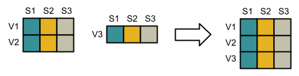

# EVA VCF Merge

Library to merge VCF files horizontally and vertically.

## Dependencies

Besides the dependencies in `requirements.txt`, the module also uses [Nextflow](https://www.nextflow.io/) to manage
merging large numbers of files, which itself requires Java 8. See Nextflow documentation for details on installation.

## Horizontal Merge

Horizontally mergeable VCFs have non-overlapping sample sets and can be combined to create a single multi-sample
file, using e.g. [`bcftools merge`](http://samtools.github.io/bcftools/bcftools.html#merge).

For example, if one VCF file has samples `S1, S2, S3` while the second has `S4`, they can be horizontally
merged and the resulting file will have samples `S1, S2, S3, S4`:

## Vertical Merge

Vertically mergeable VCFs have identical sample sets and can be combined to create a single multi-chromosome or
multi-variant file, using e.g. [`bcftools concat`](http://samtools.github.io/bcftools/bcftools.html#concat).

For example, if two VCF files both have samples `S1, S2, S3` with different variants, they can be vertically merged:

